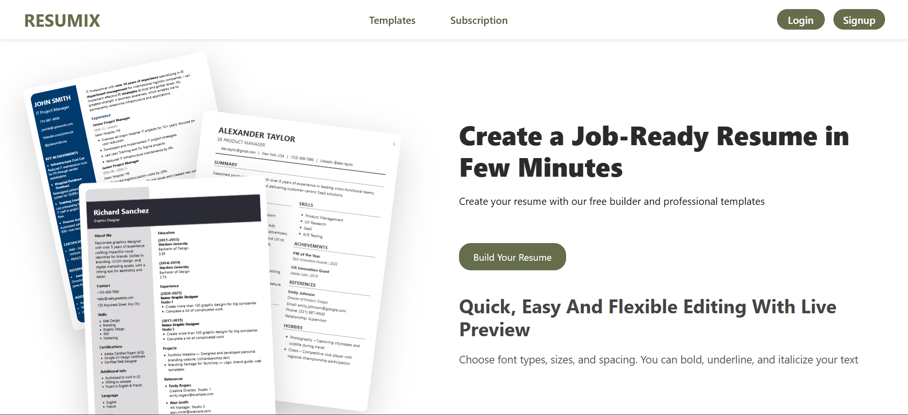
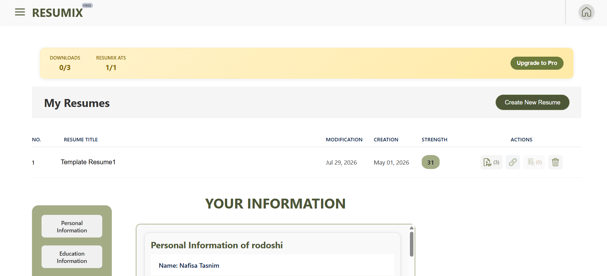
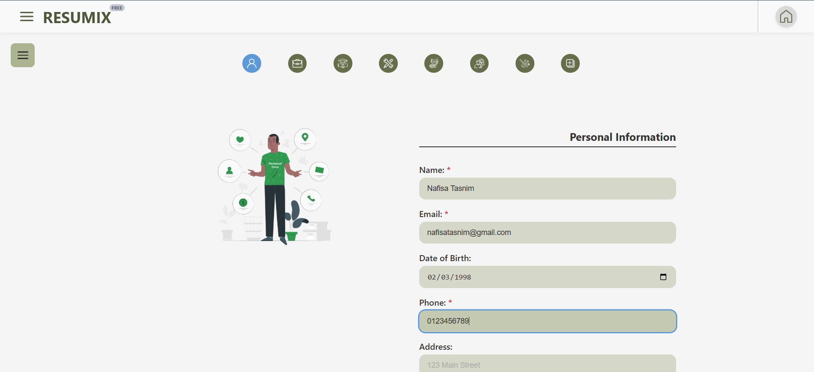
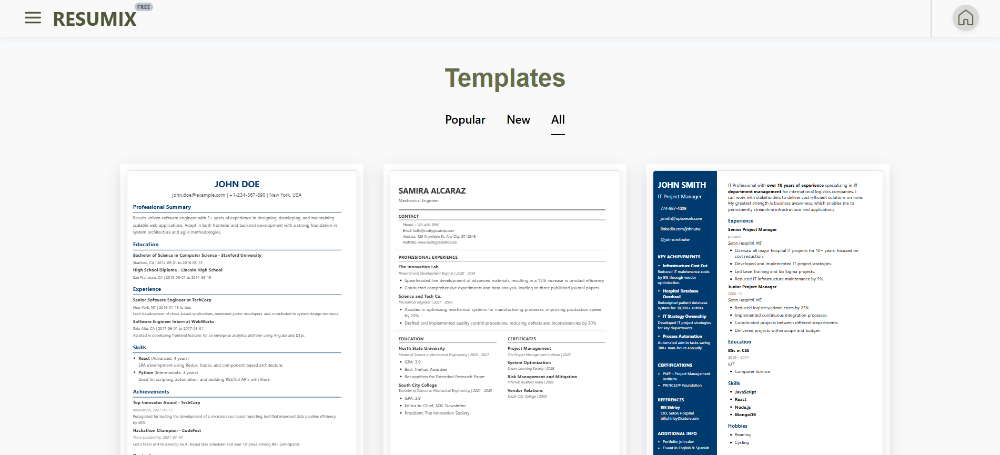
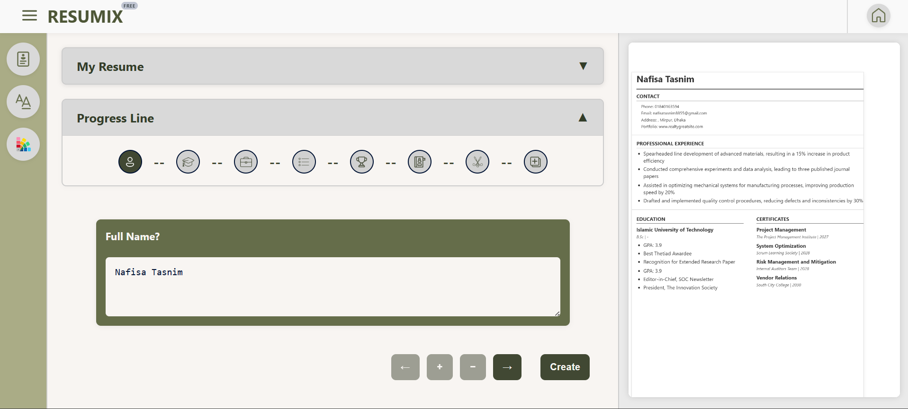
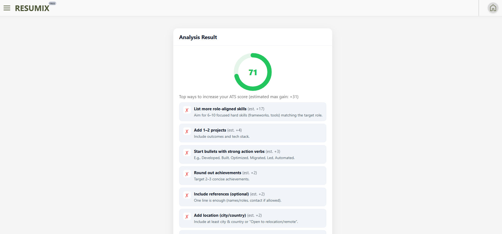
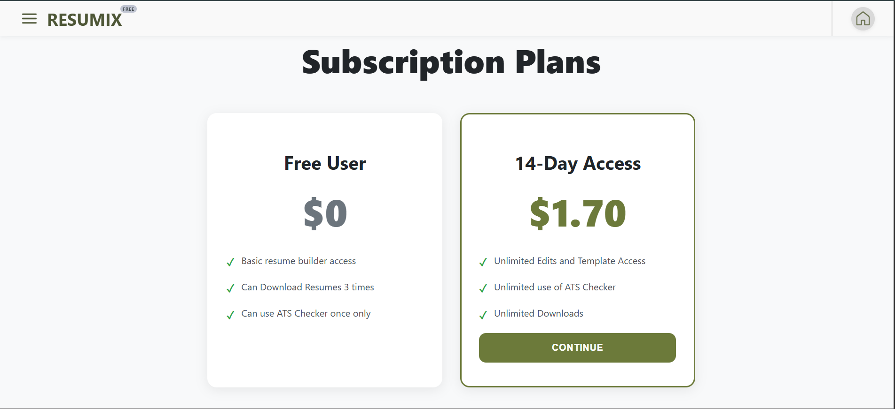
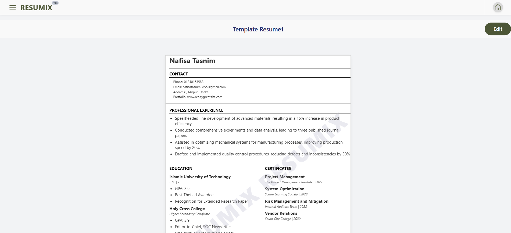

# Resumix

**Resumix** is a comprehensive, full-stack Resume Builder application designed to help users create professional, ATS-friendly resumes with ease. From data entry and template selection to real-time previewing and downloading, Resumix delivers a seamless resume-building experience.

<p align="center">
  
  
</p>

<p align="center">
  <a href="#live-demo"><strong>Live Demo</strong></a> ·
  <a href="#screenshots"><strong>Screenshots</strong></a> ·
  <a href="#features"><strong>Features</strong></a> ·
  <a href="#tech-stack"><strong>Tech Stack</strong></a> ·
  <a href="#getting-started"><strong>Getting Started</strong></a>
</p>

---

## Table of Contents

- [Live Demo](#live-demo)
- [Screenshots](#screenshots)
- [Features](#features)
  - [Resume Management](#1-resume-management)
  - [User Account & Authentication](#2-user-account--authentication)
  - [Advanced Functionality](#3-advanced-functionality)
- [Tech Stack](#tech-stack)
- [Project Structure](#project-structure)
- [Workflow](#workflow)
- [Getting Started](#getting-started)
  - [Prerequisites](#prerequisites)
  - [Installation](#installation)
  - [Environment Variables](#environment-variables)
  - [Running the App](#running-the-app)
- [Testing](#testing)
- [API Overview](#api-overview)
- [Roadmap](#roadmap)
- [Contributing](#contributing)
- [Contact](#contact)

---

## Live Demo

[View the deployed application](https://resumix-ten.vercel.app/)

---

## Screenshots

A walkthrough of the core Resumix experience, from landing page to final resume export.

### 1. Landing Page

The entry point to Resumix, introducing the platform and its core value proposition.



### 2. Dashboard

A centralized overview of all resumes created by the user, along with account and subscription status.



### 3. Personal Information Entry

Structured forms for capturing personal details, education, experience, skills, and achievements.



### 4. Template Selection

A gallery of professional resume templates that users can preview and switch between instantly.



### 5. Resume Editor

The core workspace where users edit resume content with a real-time preview of changes.



### 6. ATS Check

Built-in ATS optimization that scores resume strength and provides actionable feedback.



### 7. Subscription Management

Interface for viewing and upgrading subscription plans to unlock premium features.



### 8. Resume Preview & Share

Final resume preview with options to download as PDF or share via a public, token-based link.



---

## Features

### 1. Resume Management

- **Dynamic Resume Creation** — Users can create multiple resumes, each with its own title and data.
- **Comprehensive Data Entry** — Structured forms to capture:
  - **Personal Information**: Contact details, address, and professional links.
  - **Education**: Academic history with institution, degree, and dates.
  - **Experience**: Professional work history with job titles and employer details.
  - **Skills**: Proficiency levels and years of experience.
  - **Achievements**: Key milestones and certifications.
- **Template System** — A variety of professional HTML templates (`Resume1.html` to `Resume8.html`) that let users switch the look and feel of their resume instantly.
- **Real-time Preview** — Integration between the editor and the template renderer for immediate visual feedback.

### 2. User Account & Authentication

- **Secure Auth** — Full authentication system including Signup, Login, and Token-based verification.
- **Profile Management** — Update personal information and maintain default resume data across different resumes.
- **Subscription Tiers**:
  - **Free Tier**: Basic access with limits on downloads and ATS checks.
  - **Paid Tier**: Premium access with expanded limits and advanced features.

### 3. Advanced Functionality

- **ATS Optimization** — Built-in logic to check resume strength and provide feedback for Applicant Tracking Systems (ATS).
- **Shareable Links** — Generate unique, secure tokens to share resumes via a public link without requiring the viewer to have an account.
- **PDF Generation** — Render HTML templates into downloadable PDF documents.
- **Payment Integration** — Integrated payment gateway (via `PaymentRouter`) to handle subscription upgrades.

---

## Tech Stack

**Backend**
- Node.js and Express.js — RESTful API
- MongoDB (via Mongoose) — document-based storage for user profiles and resume data
- JWT/Token-based authentication
- CORS policies restricting access to authorized frontend domains
- Cron jobs (`subscriptionCron.js`) for automatic subscription expiry management

**Frontend**
- React.js — Single Page Application (SPA)
- Component-based, modular UI architecture
- Dynamic routing (Dashboard, Editor, Settings, Landing)

**Testing**
- Selenium — End-to-end automation tests


---

## Project Structure
```
Resumix/
├── backend/                # Node.js/Express API
│   ├── controllers/        # Request handlers (Auth, Resumes, Downloads, Payments)
│   ├── models/              # MongoDB Schemas (User, Resume)
│   ├── routes/              # API Endpoints
│   ├── services/            # Business logic (Email, Cron, Template Rendering)
│   ├── middlewares/         # Token Verification, Date Formatting, Subscription validation
│   └── templates/           # HTML Resume Layouts (Resume1.html - Resume8.html)
├── frontend/                # React Application
│   └── src/
│       ├── Components/       # UI Modules (Editor, Dashboard, etc.)
│       │   ├── ResumeEditorPage/
│       │   ├── ResumeTemplates/
│       │   ├── DashBoard/
│       │   └── SubscriptionPage/
│       └── utils/            # Helper functions (Auth, API calls)
└── selenium-tests/          # End-to-End Automation Tests
```


---

## Workflow

1. **Onboarding** — User signs up, verifies email, and enters basic profile info.
2. **Creation** — User creates a new resume and fills in sections (Education, Experience, etc.).
3. **Styling** — User browses templates, selects a layout, and previews the result.
4. **Optimization** — User runs an ATS check and improves content based on the strength score.
5. **Export** — User upgrades subscription (if needed) and downloads the final PDF or shares a public link.

---

## Getting Started

### Prerequisites

- [Node.js](https://nodejs.org/) (v16+ recommended)
- [MongoDB](https://www.mongodb.com/) (local instance or Atlas cluster)
- npm or yarn

### Installation

Clone the repository:

```bash
git clone https://github.com/NafisaTasnimR/Resumix.git
cd Resumix
```

Install backend dependencies:

```bash
cd backend
npm install
```

Install frontend dependencies:

```bash
cd ../frontend
npm install
```

### Environment Variables

Create a `.env` file inside the `backend/` directory with the following variables:

```env
PORT=5000
MONGO_URI=your_mongodb_connection_string
JWT_SECRET=your_jwt_secret
EMAIL_SERVICE_USER=your_email
EMAIL_SERVICE_PASS=your_email_password
PAYMENT_GATEWAY_KEY=your_payment_gateway_key
CLIENT_URL=http://localhost:3000
```

Update these keys and values to match your actual configuration. Do not commit `.env` files to version control.

### Running the App

Start the backend server:

```bash
cd backend
npm run dev
```

Start the frontend development server:

```bash
cd frontend
npm start
```

The application should now be running at `http://localhost:3000`, with the API served from `http://localhost:5000`.

---

## Testing

End-to-end tests are located in the `selenium-tests/` directory.

```bash
cd selenium-tests
npm install
npm test
```

---

## API Overview

| Module | Description |
|---|---|
| Auth | Signup, Login, Token verification, Profile management |
| Resumes | Create, update, delete, and fetch resume data |
| Templates | Fetch and apply resume templates |
| Downloads | Generate and download PDF resumes |
| Payments | Handle subscription upgrades via `PaymentRouter` |
| Sharing | Generate and resolve secure shareable resume links |

---

## Roadmap

- [ ] Add more resume templates
- [ ] AI-powered content suggestions
- [ ] Multi-language resume support
- [ ] Resume analytics (views, downloads)

---

## Contributing

Contributions are welcome.

1. Fork the repository
2. Create a new branch (`git checkout -b feature/your-feature`)
3. Commit your changes (`git commit -m 'Add some feature'`)
4. Push to the branch (`git push origin feature/your-feature`)
5. Open a Pull Request

---

## Contact

**Nafisa Tasnim**
GitHub: [NafisaTasnimR](https://github.com/NafisaTasnimR)

**Nishat Tasnim**
GitHub: [NishatTasnimPreownti](https://github.com/NishatTasnimPreownti)

**Mrittika Jahan**
GitHub: [Mrittika150](https://github.com/Mrittika150)

---
